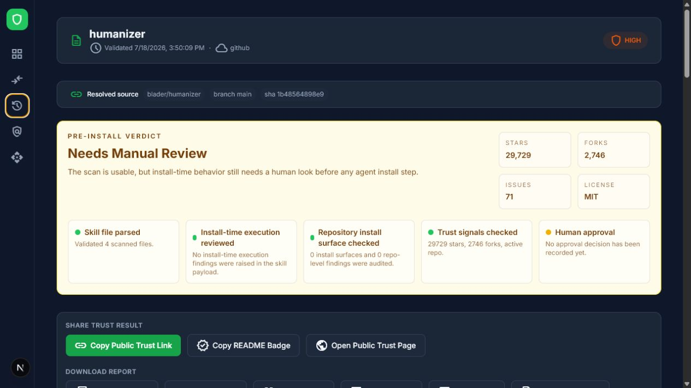

# AI Skill Shield

**Check an AI agent skill before you trust it.**

[Try the live scanner](https://ai-skill-shield.suppeng.com/) - no installation, account, or API key required for the standard scan.

SkillShield reviews `SKILL.md` packages and GitHub repositories for prompt injection, exposed secrets, dangerous commands, install scripts, dependency risks, and other software supply-chain signals before an agent runs or installs them.



## Scan a skill

1. Open the [live scanner](https://ai-skill-shield.suppeng.com/)
2. Paste a GitHub repository URL, upload a skill package, or paste a `SKILL.md`
3. Review the verdict, risky lines, and install-surface evidence

The standard static scan works without an AI provider. Optional AI review supports OpenAI, Anthropic, OpenCode Go, and OpenCode Zen when self-hosting.

## What it checks

- prompt injection and suspicious agent instructions
- exposed API keys, tokens, and private keys
- dangerous shell commands such as `curl | bash` and destructive file operations
- dynamic code execution and excessive file, environment, or network access
- package lifecycle scripts, custom registries, submodules, and GitHub workflows
- skill structure, compatibility, dependencies, and installation risk

## What the report includes

- a `Safe to Review`, `Needs Manual Review`, or `Do Not Install` verdict
- dangerous-line evidence with file and line references
- repository trust metadata and an install-surface map
- findings across 11 validation axes
- JSON, HTML, print-friendly HTML, and SARIF exports
- local report history and approve/reject actions

## Run locally (optional)

The hosted scanner is the fastest path. To keep scans on your own machine:

```bash
git clone https://github.com/adnan-iz/ai-skill-shield.git
cd ai-skill-shield
npm ci
npm run dev
```

Open [http://localhost:3000](http://localhost:3000). For optional AI review, copy `.env.example` to `.env.local` and add a supported provider key.

## CLI (source only)

The CLI is not published to npm yet. Run the included package from source:

```bash
npm install --prefix packages/cli
npm run build --prefix packages/cli
node packages/cli/dist/index.js scan ./path/to/skill
```

The CLI uses a compact local rule set. The live web scanner provides the complete repository audit and 11-axis report.

## Current scope

SkillShield performs best-effort static analysis. A clean report means no configured rule found a problem; it is not a guarantee that a skill is safe. SkillShield does not execute untrusted skills or provide a runtime sandbox.

## Tech stack

Next.js 16, React 19, TypeScript, Tailwind CSS 4, Drizzle ORM, and SQLite.

## Documentation

- [Architecture](ARCHITECTURE.md)
- [API reference](docs/api.md)
- [CLI reference](docs/cli.md)
- [GitHub Action](docs/github-action.md)
- [Scoring model](docs/scoring.md)
- [Deployment guide](docs/deployment.md)
- [Roadmap](ROADMAP.md)

## Development

```bash
npm run lint
npm run typecheck
npm test
npm run build
```

Contributions are welcome. See [CONTRIBUTING.md](CONTRIBUTING.md) and [SECURITY.md](SECURITY.md).
