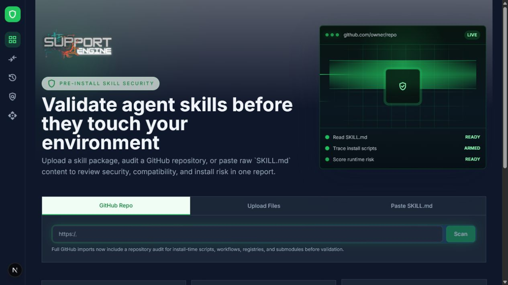
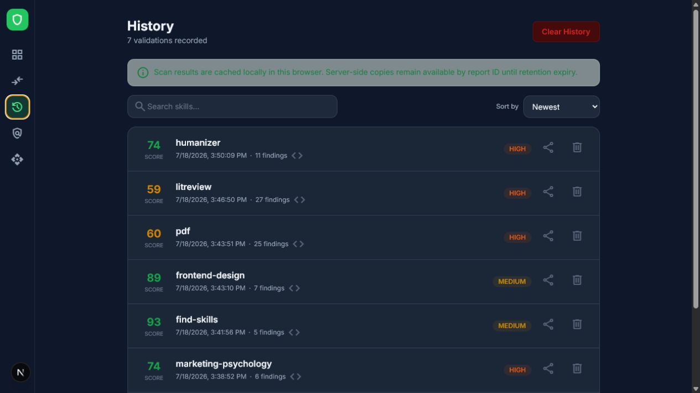
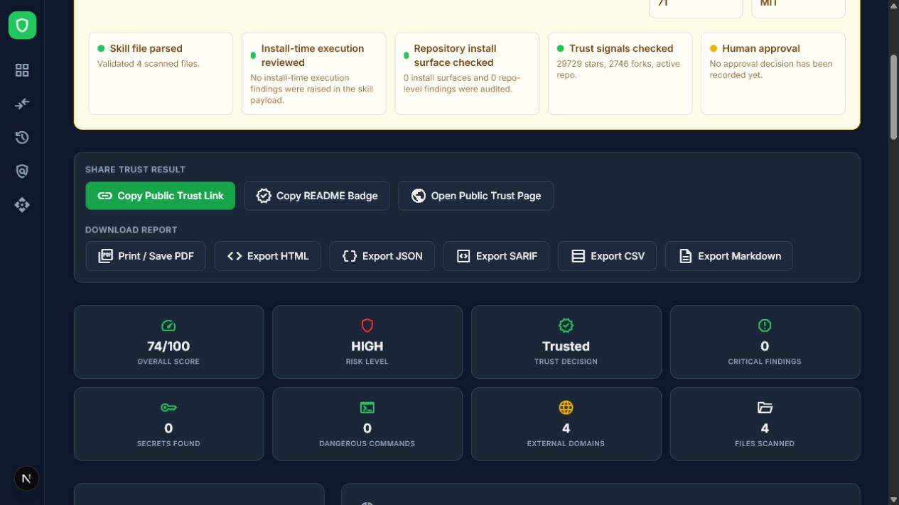
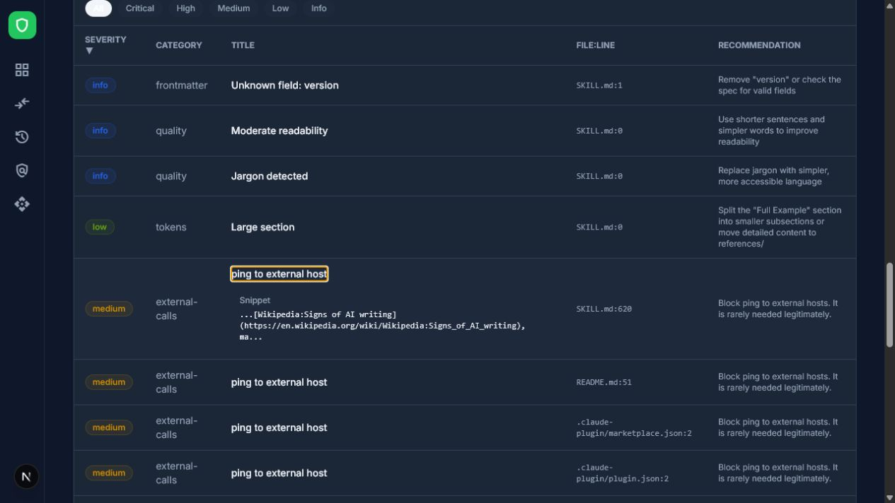

# SkillShield usability audit — AI power-user view

Date: 2026-07-18

## Verdict

| Area | Score | Read |
| --- | ---: | --- |
| Usability | 7/10 | Clear entry and strong scan history, but the report is long and the decision hierarchy is confusing. |
| Helpfulness | 5.5/10 | Useful as a triage tool; not dependable yet as an install/no-install gate. |
| Overall | 6/10 | Promising and genuinely useful, but trust-breaking contradictions and false positives need fixing first. |

## Flow reviewed

1. **Choose an input — Good.** GitHub, upload, and paste are immediately visible, with the recommended GitHub route selected by default.

   

2. **Find a prior scan — Good with friction.** Search, sorting, score, risk, and finding count are easy to scan. The entire row is clickable but does not look or behave like a semantic link, while share/delete rely on icon familiarity.

   

3. **Read the report verdict — Mixed.** Repository identity, metadata, install checks, and exports are strong. The page says “Needs Manual Review” and “HIGH” risk while also calling the same result “Trusted,” so the user cannot tell which conclusion governs the install decision.

   

   

4. **Inspect evidence — Poor.** The finding drill-down is the right interaction, but a Wikipedia URL is labeled “ping to external host.” Four similar false positives materially inflate risk and make the report hard to trust.

   

## What works

- The product explains its purpose quickly and supports the three input modes an AI-heavy user actually needs.
- Reports expose source repository, branch/SHA, file tree, file/line evidence, install surface, compatibility, history, and six export/share formats.
- The evidence drill-down is much better than an opaque score alone.

## Highest-impact problems

1. **Unify the decision model.** One report should not simultaneously say “Needs Manual Review,” “HIGH,” and “Trusted.” Make one primary verdict authoritative and explain the two or three facts that caused it.
2. **Fix scanner precision before adding more rules.** The expanded “ping” result is visibly a URL, not a command. A security product loses value quickly when obvious false positives affect its headline score.
3. **Make the report progressive.** Start with “Can I install this?” and the decisive evidence; keep 11 axes, compatibility, preview, and exports below or collapsible.
4. **Show AI-review readiness before click.** In this run, “Run AI Review” returned `AI review not configured`. Present it as disabled with a setup action instead of a live feature that fails after click.
5. **Repair decision and accessibility affordances.** Always expose an approve/reject action when no decision exists; use real links/buttons for history rows, add explicit accessible labels to icon buttons, and verify contrast, focus order, keyboard flow, reflow, and screen-reader announcements.

## Evidence limits

This was a desktop audit of the homepage, saved history, one GitHub report, evidence expansion, and the AI-review action. Mobile layouts, uploads, paste validation, destructive actions, downloads, screen readers, and full keyboard-only completion were not tested. Screenshot review can identify accessibility risks but cannot establish WCAG compliance.
